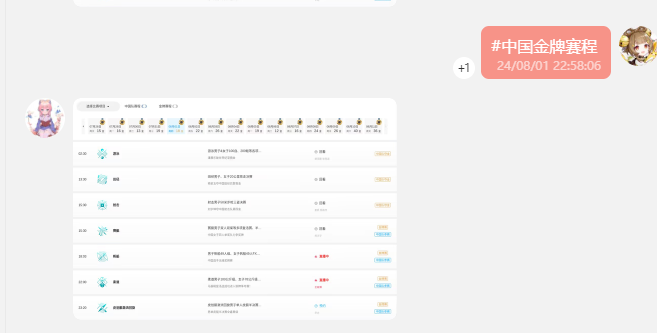

# 奥运插件

- 一个适用于 [Yunzai 系列机器人框架](https://github.com/yhArcadia/Yunzai-Bot-plugins-index) 的奥运查询插件
- 为了方便大家在QQ群分享奥运相关的一些信息，所以才有了这个插件
- 目前支持2024年巴黎奥运会的相关查询，如下：
  1. 查询迄今为止前16个国家或地区的奖牌榜
  2. 查询某个国家或地区的奖牌详情
  3. 查询今日的全部或中国或金牌赛事的赛程

## 安装插件

#### 1. 克隆仓库

```
git clone https://github.com/xiaomifan233/olympic-plugin.git ./plugins/olympic-plugin
```

> [!NOTE]
> 如果你的网络环境较差，无法连接到 Github，可以使用国内的仓库 [Gitee](https://gitee.com/)
>
> ```
> git clone https://gitee.com/xiaomifan233/olympic-plugin.git ./plugins/waves-plugin
> ```
本插件没有额外依赖，所以无需额外安装任何依赖

## 功能列表

请使用 `#奥运帮助` 获取完整帮助

- [x] #\(今日|奥运\)\(总榜|榜单|排名\)
- [x] #\(.*\)奖牌\(榜单|详情\)可选
- [x] #\(今日|奥运\)可选\(中国\)可选\(金牌\)可选 赛程

- ## 功能列表

<details><summary>点击展开</summary>

| 命令       | 功能           | 示例                                  |
|----------|--------------|-------------------------------------|
| #奥运总榜    | 获取前16的奖牌榜    |    |
| #中国/日本奖牌 | 获取某个国家的奖牌详情  |    |
| #今日赛程    | 获取今日所有赛程     |      |
| #中国赛程    | 获取今日中国赛程     |      |
| #金牌赛程    | 获取今日金牌赛程     |    |
| #中国金牌赛程  | 获取今日所有中国金牌赛程 |  |

</details>
## 支持与贡献

为中国队加油，预祝中国队能在奥运赛场上取得满意的成绩！
如果你喜欢这个项目，不妨点个 Star🌟，这是对开发者最大的动力！！


有意见或者建议也欢迎提交 [GitHub Issues](https://github.com/xiaomifan233/olympic-plugin/issues)和 [Pull requests](https://github.com/xiaomifan233/olympic-plugin/pulls)。
